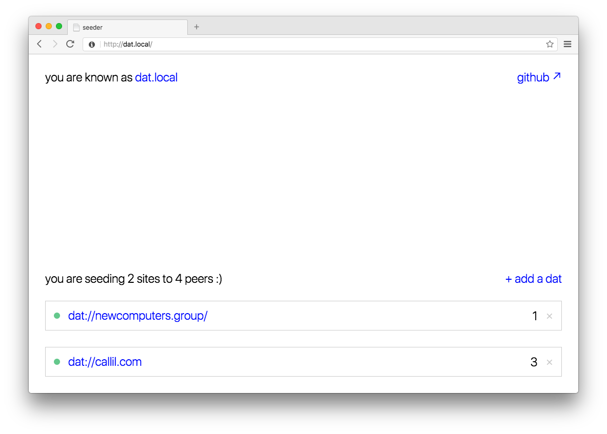

# seeder
A Raspberry Pi DAT seeder (early-development stage).



It's just a seeder, without HTTP mirroring or anything special, yet.

## installation
```
$ curl -o- https://raw.githubusercontent.com/new-computers/seeder/master/install.sh | bash
```
It'll install everything you need.

Or alternatively clone this repo to `/home/pi/seeder` and run the server with `sudo node server.js` on port 80.

## usage
The installation script adds a service to `systemd` called `dat`: a web server running on port 80 that's the frontend for the seeder and seeds the archives (via [`dat-node`](https://github.com/datproject/dat-node)). 

Navigate to the Pi's address (in my case it's ```http://seeder.local```) and manage your sources.

### HTTP mirroring
1. Add the archive to the seeding list.
2. Add the url. (**currently**: add it to `data.json` manually and restart the service with `sudo systemctl restart dat`)
3. Probably you have to setup **port-forwarding** on your router.
4. Add an **A record** to the domain that points to your IP address and the forwarded port.
5. You're done!

## development

Clone the repo, then:
```
npm install
npm run build
npm start dev
```

### `data.json` structure
```javascript
{
	feeds: [
		{
			url: string,
			paused: boolean <optional>,
			timeout: number <optional>,
			http: string <optional>
		}
	]
}
```

## todo
- [ ] HTTP mirroring test with real domain and stuff
- [ ] frontend to add http url
- [ ] start mirroring when added from frontend
- [ ] let's encrypt (greenlock-express alternative for koa)
- [x] read dat.json of archive and use it (fallback_page, etc.)
